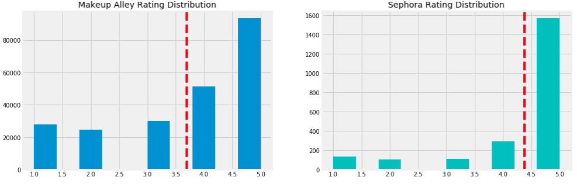
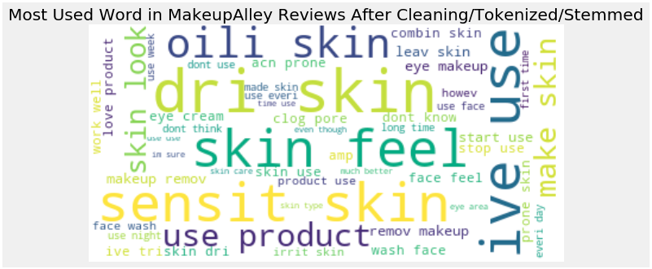
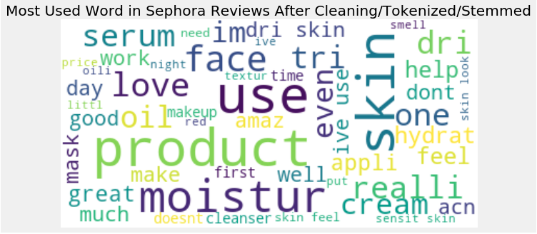

# What's on Your Face!?...Be Honest

**MOTIVATION**
My goal is to create a predictive model to identify authentic/honest reviews on Sephora website utilizing One Class Classfication Support Vector Machine

My curiosity in beauty industry has gone beyond finding out what kind of chemicals are used in cosmetics. (See my past project https://github.com/suchayarj/WhatsOnYourFace)

Online marketplace has become the dominant platform for people to buy and trade. Fake online reviews are definitely unavoidable. A few years back, there was a fake review scandal on Sunday Riley Company where it sent out emails to employees forcing them to write fake reviews on Sephora given a quite thorough walkthrough, i.e. turn off cookie and review a few products that are not SR before actually review SR, which made it even harder for web users to differentiate it from authentic reviews. 

**PIPELINE**

Webscrape (BeautifulSoup) --> Pandas DataFrame --> EDA / Text Analysis using NLTK(Tokenized, Vectorized) --> One Class Classification SVM Model

**DATASET**

- **Training set** : creating my own dataset by performing a webscape from skincare category on www.makeupalley.com. Dataset consists of approximately 230,000 entries. I am treating reviews from this website as **authentic** since this website's sole purpose is for beauty community to share honest reviews, while Sephora or Ulta or other beauty sites are trying to sell products  
- **Testing set**: using existing dataset from (github links) reviews scraped from skincare category on www.sephora.com. Reviews from Sephora are more diverse. It consists of both authentic and fake. 

**EDA/Text Analysis**
- clean dataset (MakeupAlley & Sephora), filter review columns, prep them for text analysis using NLTK
- Ratings:
    
    Sephora, who's infamous for fake reviews, has average rating of approximately 4.3, while Makeup Alley has lower average at around 3.7. 70% of the rating on Sephora were 5 stars, which could be an indicator of fake reviews. On the other hand, Makeup Alley rating distribution seems more fair and authentic, with 4 stars being around 40%, while 2, 3, and 5 stars are about the same portion.

  

- Reviews:
    - Review length distributions/stats
        
        Reviews on make up Makeup Alley tends to be longer than Sephora. The median of MA reviews is roughly 400-500 words per review, while Sephora's median is roughly 300 words per review
     

    
    

    
    - most frequently used word in the reviews

        Frequently used words are pretty similar.
    

    
    
    

**MODEL**

- Since Sephora has both honest & fake reviews, as well as my limited ability in obtaining instances on fake reviews, I decided to use One Class Classification from Support Vector Machine algorithm which is appropriate for Unsupervised Outlier Detection. 

- Gridsearch to get the best parameter

