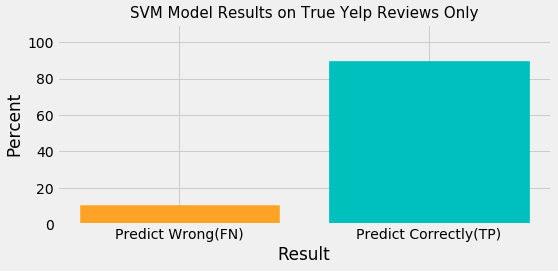
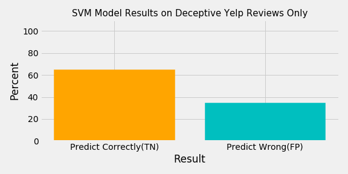
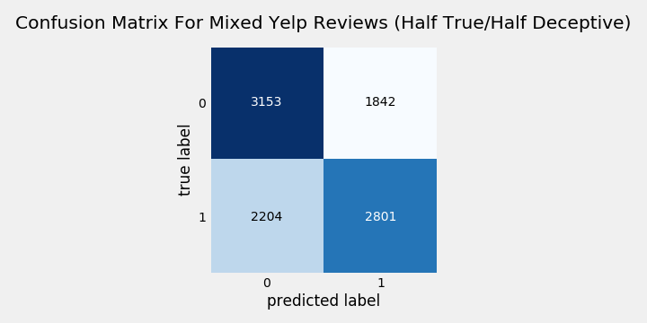

# What's on Your Face!?...Be Honest

**MOTIVATION**

My goal is to create a predictive model to identify fake/deceptive reviews on Sephora website utilizing One-Class Classfication Support Vector Machine

My curiosity in beauty industry has gone beyond finding out what kind of chemicals are used in cosmetics. (See my past project https://github.com/suchayarj/WhatsOnYourFace)

Online marketplace has become the dominant platform for people to buy and trade. Fake online reviews are definitely unavoidable. A few years back, there was a fake review scandal on Sunday Riley Company, where it forced its employees to write fake reviews on Sephora given a quite thorough walkthrough on how not to be caught as fake. I found it challenging and inspired to develop a model that's able to detect a pattern of fake reviews.

**WORKFLOW**

Collect data > Load into Pandas DataFrame > EDA > Natural Languange Processing > One Class Classification SVM Model

**DATASET**
- Makeup dataset
    - **Training set** : creating my own dataset by performing a webscape from skincare category on www.makeupalley.com. 
        - Dataset consists of approximately 230,000 entries, containing columns like Review Text, Rating, Product Name, Brand Name, User Name, and User Skin Types. 
        - I will be using only the review text and rating of the reviews to train the model. 
        - I am treating reviews from this website as **authentic** since this website's sole purpose is for beauty community to share honest reviews, while Sephora was made to sell products  
    - **Testing set**: using existing sephora reviews dataset from Github, focusing on skincare category. 
        - Reviews from Sephora are more diverse. It consists of both authentic and fake. 
- Dataset used to evaluate the model 
    - **Yelp Review Dataset** from https://github.com/zzhang83/Yelp_Sentiment_Analysis. The reviews had been labeled to True & Deceptive. I need this in order to tune my model since one class SVM is unsupervised and I need to assure that my model works with labeled data before deploying

**EDA/Text Analysis**
- Clean dataset (MakeupAlley & Sephora), filter review columns, prep them for text analysis using NLTK
- Ratings:
    
    Sephora has average rating of approximately 4.3, while Makeup Alley has lower average at around 3.7. 70% of the rating on Sephora were 5 stars, which could be an indicator of fake reviews. On the other hand, Makeup Alley rating distribution seems more fair and authentic, with 4 stars being around 40%, while 2, 3, and 5 stars are about the same portion.

  

- Reviews:
    - Review length distributions/stats
        
        Reviews on make up Makeup Alley tends to be longer than Sephora. The median of MA reviews is roughly 400-500 words per review, while Sephora's median is roughly 300 words per review
     

    
    

    
    - 50 most frequently used word in the reviews
        Makeup Alley and Sephora 50 most used words in reviews are fairly similar.
        However, Makeup Alley words include some negative/contrasting words, while Sephora reviews have more of positive adjectives (See words circled in red)
    

    
    

**MODEL**

- Since Sephora has both honest & fake reviews, as well as my limited ability in obtaining instances on fake reviews, I decided to use One Class Classification from Support Vector Machine algorithm which is appropriate for Unsupervised Outlier Detection. 
- The one-class SVM is given points only from one class, and expected to learn a separation between members of that class and anything else during training.
- One we feed new data to the model, and if that particualar data does not belong to authenric group, it will be classified as 'fake'

**DEVELOP MODEL USING YELP DATASET**
- Tune parameter using Yelp review dataset since it's labeled so I can evaluate the model's performance. 
- Results of the Yelp model using true reviews only, deceptive reviews only, and mixed Yelp reviews, respectively
   parameter for OneClassSVM I used is nu= 0.1, kernel = 'rbf' (Gaussian), and gamma = 0.1

    
    
    
    

**APPLY MAKEUP DATESET TO THE MODEL**
- Since One Class Classification SVM is an unsupervised learning, the confusion matrix for the model on Sephora prediction is not avaiable. But with nu = 0.1 on the training dataset, I can be confident that there's at most 10% error in the prediction. **Please note that nu can be adjusted per business use case. 

**CONCLUSION**
- Apparent difference between authentic and fake reviews are:
    - Length of the reviews: Fake reviews tend to be shorter than Authentic reviews
    - Type of words used: Fake reviews contained more positives like

**FUTURE WORK**

To improve the model I will...
- Incorporate users information such as age and number of reviews into the model to improve accuracy
- Expand stop words list (words such as skin, product, dry)
- Adjust word filtering process
    -  Not lowercasing all the words, since reviews that are all in caps tend to be less authentic.
    - Keep exclamation points since reviews with repeated exclamation points are more likely to be less authentic
- Test model on the brand that has the scandal

**See project utilizing neural network**
https://github.com/suchayarj/WhatsOnYourFace...FakeOrFact

